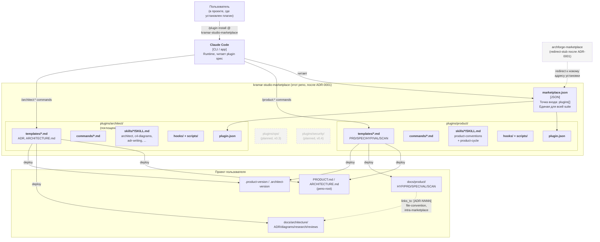

# Architecture

> **Что это за документ.** Живое архитектурное состояние проекта — что система делает, какие требования она должна удовлетворять, как она устроена сегодня, какие решения её к этому привели и что остаётся открытым. Обновляется всякий раз, когда меняется любое из перечисленного.
>
> **Чем он не является.** Это не дизайн-документ, не roadmap и не маркетинговая страница. Держи его коротким, актуальным и честным. Устаревшее или «как хотелось бы» содержимое здесь хуже, чем его отсутствие.
>
> **Как обновлять.** Правь этот файл в одном изменении с кодом/ADR, который меняет состояние. Если секция перестала быть точной — чини сейчас, не «потом».

---

## 1. System summary

Marketplace плагинов для Claude Code, на котором живёт **полная suite роль-плагинов Kramar IT Studio**: `product` (продакт-менеджмент), `architect` (архитектурный цикл — поглощён из соседнего `archforge-marketplace` по [ADR-0001](./docs/architecture/decisions/0001-absorb-archforge-into-kramar-studio-marketplace.md)), и по roadmap'у — `ops` (runbooks, on-call, retro) и `security` (threat modeling, security review). Каждый плагин внутри marketplace устанавливается независимо; cross-link `links_to: [ADR-NNNN]` между артефактами разных плагинов работает по файловой конвенции (`docs/<role>/...`), без semver- или install-coupling. «Система» — это набор markdown-команд, skill'ов, шаблонов и bash-хуков, который Claude Code устанавливает в проекты пользователей; код приложения не поставляется. Мета-форма (цикл, frontmatter с lifecycle, cross-link через `links_to`, soft hooks, сервисные команды `init`/`upgrade`/`status`, push-back tone) — единая для всех плагинов suite и эволюционирует синхронно.

---

## 2. Quality attributes

<!-- Заполни конкретно. «Быстро» — не требование; «p95 < 200ms на каталоге» — требование. -->

| Attribute | Target | Notes |
|---|---|---|
| Совместимость с Claude Code plugin spec | 100% валидных `plugin.json` / `marketplace.json` против JSON Schema из `json.schemastore.org` | Marketplace неработоспособен, если schema-валидация падает у Claude Code. |
| Soft-failure всех хуков | Хуки **никогда** не возвращают non-zero, не блокируют tool use, не правят файлы | Закреплено в README §2. Любое отклонение — баг. |
| Bounded scope плагина | Один плагин = одна роль; роль = одно слово lowercase | См. README §1. Решает вопрос «куда положить новую команду». |
| Cross-role линковка | Артефакт с архитектурной зависимостью имеет `links_to: [ADR-NNNN]` или явную пометку «no ADR yet» | Граф ссылок — продукт компаундирования. Хук эмитит warning, не error. |
| Migration safety | `/<role>:upgrade` идемпотентен; ID никогда не переиспользуются; артефакты не удаляются (только status transition) | См. README §4 lifecycle и `commands/upgrade.md`. |
| Время от правки до проверки | ≤ 30 секунд: edit → `/reload-plugins` → команда работает | Нет build/test шага намеренно — это проверочный цикл, не CI. |
| Языковая дисциплина | Источник плагина — English; артефакты в проекте пользователя — на языке пользователя; идентификаторы (IDs, имена команд, prescribed headers) — verbatim в любом языке | См. README §10. |

---

## 3. High-level structure

> Diagram отражает целевое состояние после ADR-0001. На момент написания этого документа реальный move кода `archforge` в `plugins/architect/` ещё не выполнен; см. ADR-0001 § Implementation status.

Детальные L3-разрезы (когда появятся: per-команда поток, формат payload хука, схема front-matter артефактов) — в [`docs/architecture/diagrams/`](./docs/architecture/diagrams/).

---

## 4. Key constraints

- **Команда** — solo maintainer (Igor Kramar). Исключает multi-engineer-only паттерны: code-owners, PR-rotations, asynchronous review processes. Любая дисциплина должна работать на одного человека.
- **Operational** — никакого build/test/lint pipeline. Только git + Claude Code как runtime. Iteration loop: edit → `/reload-plugins`. Это сознательный выбор, не недостроенность.
- **Технический** — фиксирован Claude Code plugin spec и его JSON-схемы (`marketplace.json`, `plugin.json`, `hooks.json`). Любое изменение формата — внешний breaking change, под который мы подстраиваемся, а не наоборот.
- **Methodology** — `archforge-marketplace` — reference implementation. Каждое расхождение в shape (структура каталогов, lifecycle статусов, frontmatter, две skill'ы на плагин и т.д.) — баг плагина, а не legitimate variation. Это закреплено в README «Kramar Studio Plugin Conventions».
- **Scope** — out-of-scope by design: frontend, design, qa, pm, tech writer плагины. Студия носит только те роли, которые носит реально. Каждый «давай ещё плагин» проходит через этот фильтр.
- **Stack пользователя** — неизвестен и не должен иметь значения. Плагины генерируют markdown; всё, что они «знают» о стеке пользователя — то, что Claude Code прочитает в session-context.

---

## 5. Decision index

<!-- Каждый принятый ADR попадает сюда. Сортировка по номеру, новые наверху. Одна строка на запись. Superseded ADR не удаляются — статус меняется. -->

| # | Date | Status | Decision |
|---|---|---|---|
| [0002](./docs/architecture/decisions/0002-multi-level-versioning-contract.md) | 2026-05-10 | Accepted | Multi-level versioning contract: per-plugin semver + marketplace-as-schema-version + 8 правил (breaking-definition, символический 1.0.0, no formal dependencies, CHANGELOG audit-trail) |
| [0001](./docs/architecture/decisions/0001-absorb-archforge-into-kramar-studio-marketplace.md) | 2026-05-10 | Accepted (implemented) | Поглотить плагин `archforge` в `kramar-studio-marketplace`; `archforge-marketplace` → redirect-stub |

ADR-файлы лежат в [`docs/architecture/decisions/`](./docs/architecture/decisions/).

---

## 6. Open questions

- ~~**Двухуровневое версионирование.**~~ **Закрыт через [ADR-0002](./docs/architecture/decisions/0002-multi-level-versioning-contract.md):** per-plugin independent semver + `marketplace.json.version` как schema/curation version + 8 правил (breaking-definition, символический 1.0.0, no formal dependencies, CHANGELOG audit-trail). После ADR-0001 marketplace остаётся `0.1.0` (структура manifest не изменилась).
- **Когда выделять новую skill.** Конвенция: ровно две skill'ы на плагин (`<role>-conventions`, `<role>-cycle`). Исключение допускается «когда возникает явно отдельное тело знания» (как `c4-diagrams`, `adr-writing` в `architect` — раньше `archforge`). Где порог? Сегодня размытый — нужен либо ADR с критериями, либо явный отказ от этого исключения.
- **Стратегия миграций артефактов.** `/product:upgrade` обещает запустить миграции из `plugins/product/migrations/NNNN-from-X.Y.Z-to-A.B.C.md`. Но: формат миграционного файла не зафиксирован, нет процедуры тестирования миграции до релиза, нет ответа на вопрос «миграция повредила артефакты в чужом проекте — как откатить». В v0.1 миграций нет — пока только tactical, но это станет blocking при первом breaking-change апгрейде.
- ~~**Cross-marketplace dependency на `archforge`.**~~ **Закрыт через [ADR-0001](./docs/architecture/decisions/0001-absorb-archforge-into-kramar-studio-marketplace.md):** вопрос dissolve через поглощение `archforge` в этот marketplace. Cross-link `links_to: [ADR-NNNN]` теперь intra-marketplace, работает по файловой конвенции, без install- или semver-coupling.
- **Quality control без тестов.** Плагины — markdown + bash, тестов нет, CI нет. Как ловить регрессии: «команда стала генерировать сломанный frontmatter», «hook падает с ошибкой парсинга на новой версии Claude Code»? Нужна процедура (manual checklist? snapshot artifacts?) — иначе следующий plugin прибавит surface area для невидимых поломок.

---

## 7. Anti-patterns to avoid

<!-- Project-specific traps. Что мы решили НЕ делать, и одной строкой почему. Будущие контрибьюторы (и AI-агенты) читают это, чтобы не предлагать уже отвергнутый подход. -->

- **Не превращать хуки в CI-гейты.** Никаких `exit 1`, никакой блокировки tool use, никаких авто-правок файлов. Если хочется enforcement — это отдельный инструмент (pre-commit, GitHub Action), не плагин Claude Code. Закреплено в README §2.
- **Не плодить плагины «на будущее».** Только роли, которые студия носит реально. Frontend, design, qa, pm, tech writer — out of scope by design, не «todo». Расширение списка ролей требует пересмотра этого правила в README, а не молчаливого добавления плагина.
- **Не расходиться с `architect` shape.** Структура каталогов, две skill'ы, soft-hooks, lifecycle статусов, frontmatter-контракт — копируются из `architect` (бывшего `archforge`, теперь reference implementation внутри этого же marketplace) дословно. Любое «творческое отличие» — баг плагина, не legitimate variation. Это страхует marketplace от расходящихся диалектов.
- **Не переименовывать prescribed section headers при переводе.** Артефакты на русском, но `## Success metric`, `## Acceptance criteria`, `## Verdict` — verbatim. Переименование десинхронизирует с тем, что ищут хуки и `/<role>:status`.
- **Не делать клиент-side enforcement через хуки и serverside через скрипты одновременно.** Хук — единственная точка soft-warnings. Скрипты — то, что хуки запускают. Размывание ответственности (например, хук, который зовёт CI-скрипт, который что-то блокирует) воссоздаёт CI-гейт через заднюю дверь.
