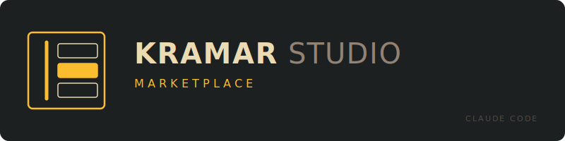

<p align="center">
  
</p>

<p align="center">
  <strong>English</strong> · <a href="./README.ru.md">Русский</a>
</p>

<p align="center">
  <a href="./LICENSE"></a>
  
  
</p>

---

A Claude Code [plugin marketplace](https://docs.claude.com/en/docs/claude-code/plugin-marketplaces) hosting role-specific plugins for **Kramar IT Studio**: a structured way to run architecture, product, ops, and security work as repeatable cycles with durable artifacts.

> **Single Kramar Studio Suite.** As of [ADR-0001](./docs/architecture/decisions/0001-absorb-archforge-into-kramar-studio-marketplace.md), the `architect` plugin (architecture role; previously `archforge` in its own `archforge-marketplace`) lives here as a peer of `product`. The original `archforge-marketplace` repo is now a redirect-stub. All role-plugins share one meta-form (cycle, frontmatter with lifecycle, cross-link via `links_to`, soft hooks, service commands) and evolve in sync under one maintainer.

## Plugins

| Plugin | Status | Version | Purpose |
|---|---|---|---|
| **`architect`** | 🟢 active | `1.0.0` | Architecture role — Discover → Design → Decide → Document → Review cycle. Skills for C4, ADR, system design, frontend/backend/AI-agents architecture, code review, research. Router skill `architect:role`. |
| **`product`** | 🟢 active | `1.0.0` | Market-scan (quarterly anchor) + per-feature cycle Discover → Define → Spec → Validate, plus `prioritize` over a backlog. Artifacts: HYP/PRD/SPEC/VAL/SCAN, cross-linked to ADRs from `architect`. |
| **`ops`** | ⚪ planned | `0.3` | Operations role — runbook authoring, on-call posture, incident retrospectives. |
| **`security`** | ⚪ planned | `0.4` | Security role — threat modeling, security review, dependency posture. |

> **Out of scope on purpose:** frontend, design, qa, pm, tech writer. The studio runs solo today; only the roles I actually wear get a plugin.

## Installation

From inside Claude Code:

```text
/plugin marketplace add https://github.com/Kramar-IT-Studio/kramar-studio-marketplace
/plugin install architect@kramar-studio-marketplace
/plugin install product@kramar-studio-marketplace
```

Plugins install independently — you can take just `architect`, just `product`, or both (recommended for the full suite).

After install, run `/reload-plugins` (or restart Claude Code) and verify with `/plugin list`.

<details>
<summary><strong>Local development install</strong></summary>

```text
/plugin marketplace add /absolute/path/to/kramar-studio-marketplace
/plugin install architect@kramar-studio-marketplace
/plugin install product@kramar-studio-marketplace
```

</details>

<details>
<summary><strong>Migrating from <code>archforge-marketplace</code></strong></summary>

If you previously installed `archforge` from the old marketplace:

```text
/plugin marketplace remove archforge-marketplace        # optional cleanup
/plugin marketplace add https://github.com/Kramar-IT-Studio/kramar-studio-marketplace
/plugin install architect@kramar-studio-marketplace
```

All `/archforge:*` commands are now `/architect:*`. The router skill identifier changed from `archforge:architect` to `architect:role`. The version marker file is now `.architect-version` (was `.archforge-version`).

See the plugin's [CHANGELOG](./plugins/architect/CHANGELOG.md) for the full breaking-change list.

</details>

## Quick start

```text
# Architecture cycle
/architect:init                            # bootstrap ARCHITECTURE.md and docs/architecture/
/architect:cycle "<problem>"               # full cycle: Discover → Design → Decide → Document
/architect:adr "<decision>"                # shortcut: write ADR directly
/architect:review [path]                   # architectural code review

# Product cycle
/product:init                              # bootstrap PRODUCT.md and docs/product/
/product:market-scan "<area>"              # rare — quarterly or new area
/product:discover "<feature>"              # per-feature cycle, phase 1
/product:define "<feature>"                # phase 2 — PRD with success metric
/product:spec "<feature>"                  # phase 3 — implementation spec
/product:validate "<feature>"              # phase 4 — post-launch validation
/product:status                            # what's in flight, what's stale
```

See [`plugins/architect/README.md`](./plugins/architect/README.md) and [`plugins/product/README.md`](./plugins/product/README.md) for full references.

## Architecture trail

The marketplace itself is built using its own methodology — every significant decision is captured as an ADR.

- [`ARCHITECTURE.md`](./ARCHITECTURE.md) — living architectural state
- [`STRATEGY.md`](./STRATEGY.md) — product strategy (target problem, approach, tracks)
- [`docs/architecture/decisions/`](./docs/architecture/decisions/) — accepted ADRs
- [`docs/architecture/decision-map.md`](./docs/architecture/decision-map.md) — open decisions and dependency graph

<details>
<summary><strong>Kramar Studio Plugin Conventions</strong> (binding spec for every plugin in this marketplace)</summary>

These conventions apply to **every plugin in this marketplace**. New role plugins (ops, security, …) inherit these rules verbatim. If a plugin diverges, it's a bug in the plugin, not a precedent.

### 1. One plugin per role

Each plugin owns exactly one role of the studio. The plugin name is the role name in lowercase: `architect` (architecture), `product`, `ops`, `security`.

A role-plugin is responsible for:

- The cycle of decisions in that role (e.g. discover → decide for architecture, market-scan + discover → define → spec → validate for product).
- The artifacts that role produces and how they cross-reference other roles' artifacts.
- A router skill that activates whenever the conversation drifts into that role's territory.
- A migration command (`upgrade`) that moves the project's artifacts to the currently installed plugin version.

### 2. Discipline, not gates

All plugins in this marketplace use **soft, non-blocking hooks**. A hook can:

- Print a reminder to stderr.
- Suggest a next command.
- Refuse to be silent when something looks off.

A hook **never aborts the session, never blocks tool use, never auto-commits, never edits files behind the user's back.** Architecture and product discipline come from the cycle being lower-friction than skipping it, not from coercion.

### 3. Standard layout under `docs/<role>/`

Every plugin writes its artifacts to `docs/<role>/` in the user's project, with a fixed sub-structure:

```
docs/<role>/
├── README.md                 ← index of this directory (auto-maintained by /<role>:init|upgrade)
├── <ROLE>.md                 ← root document for the role (e.g. ARCHITECTURE.md, PRODUCT.md)
├── <category>/               ← role-specific subdirectories
│   ├── 0001-<slug>.md
│   └── ...
└── .last-<command>           ← marker files for hooks (e.g. .last-observe, .last-market-scan)
```

`architect` uses `decisions/`, `diagrams/`, `research/`, `reviews/`. `product` uses `discoveries/`, `prds/`, `specs/`, `validations/`, `research/` (for market-scans), plus `backlog.md`. `ops` and `security` will define their own when scaffolded — but always under `docs/<role>/`.

### 4. Front-matter on every artifact

```yaml
---
id: <ROLE_PREFIX>-NNNN          # ADR-0001, HYP-0001, PRD-0001, SPEC-0001, VAL-0001, SCAN-0001
status: draft | active | accepted | superseded | archived
created_at: YYYY-MM-DD
role: <role>                    # architect | product | ops | security
links_to:
  - ADR-0007
  - HYP-0003
---
```

| Role | Prefix | Artifact |
|---|---|---|
| `architect` | `ADR-` | Architecture Decision Record |
| `product` | `SCAN-` | Market scan |
| `product` | `HYP-` | Discovery hypothesis |
| `product` | `PRD-` | Product Requirements Document |
| `product` | `SPEC-` | Implementation spec |
| `product` | `VAL-` | Post-launch validation |
| `ops` | TBD | TBD |
| `security` | TBD | TBD |

**`status` lifecycle:** `draft` → `active` → (`accepted` | `superseded` | `archived`). Never delete an artifact; transition its status. Superseded artifacts must point at the artifact that supersedes them via `links_to`.

**`links_to` is the cross-role glue.** A PRD that demands a database migration links to the relevant ADR. The graph is what makes the marketplace compound.

### 5. Mandatory cycle, with state

Every role has a finite, opinionated cycle encoded in slash commands. Skipping a phase is allowed but visible — `/<role>:status` reports artifacts that look like they short-circuited the cycle.

- `architect`: `discover → design → decide → document → review`
- `product`: `discover → define → spec → validate` (per-feature) + `market-scan` and `prioritize` outside the per-feature loop

The cycle structure is **part of the plugin's contract** — a fork that adds or removes phases is a different plugin, not a customization.

### 6. Standard service commands

| Command | Purpose |
|---|---|
| `/<role>:init` | Bootstrap `docs/<role>/`, write the role's `<ROLE>.md` template, write the `.<role>-version` marker. Idempotent. |
| `/<role>:upgrade` | Migrate the project's artifacts and `<ROLE>.md` from the version recorded in `.<role>-version` to the version of the currently installed plugin. |
| `/<role>:status` | Read-only report: what's in flight, what's stale, what cross-references are broken. |

### 7. Versioning contract

Per [ADR-0002](./docs/architecture/decisions/0002-multi-level-versioning-contract.md):

- **Per-plugin independent semver.** Each plugin evolves at its own cadence.
- **`marketplace.json.version`** = manifest schema / curation policies version, NOT aggregate suite stability.
- **`.<plugin>-version`** marker in user's project mirrors `plugin.json.version` at last successful `init` or `upgrade`.
- **Breaking change** = rename/remove contribution points (commands, skills, agents, hooks); change input schema; change frontmatter contract.
- **Symbolic `1.0.0`** allowed once per plugin at the `scaffolded → active` transition.
- **`dependencies` field** in `plugin.json` is not used; cross-plugin links go through `links_to: [ADR-NNNN]` file conventions.
- **CHANGELOG** is mandatory for every plugin and every bump.
- **Migrations** are separate files `plugins/<role>/migrations/NNNN-from-X.Y.Z-to-A.B.C.md`, run sequentially by `/<role>:upgrade`. Each file carries `migration / from / to / mutates_frontmatter / scope` front-matter and fixed body sections (`Summary`, `Preconditions`, `Transform`, `Backup`, `Verification`, `Rollback note`, `Never`). The runner writes the `.<plugin>-version` marker after each successful step (per-step atomicity); a mid-run failure leaves the marker at the last completed step. A backup is taken before any front-matter mutation. The marker's location is plugin-specific and declared in the plugin's `<role>-conventions` skill (`product`: repo-root `.product-version`; `architect`: `docs/architecture/.architect-version`). See [ADR-0003](./docs/architecture/decisions/0003-migration-format-and-procedure.md).

### 8. Two skills per plugin (minimum)

Each plugin ships at least:

- **`<role>-conventions`** — front-matter rules, ID allocation, file layout, lifecycle states, cross-role linking.
- **`<role>-cycle`** — methodology: what each phase produces, when to skip vs run, common failure modes.

Adding more skills is allowed when a clearly distinct body of knowledge emerges (e.g. `architect` ships `c4-diagrams`, `adr-writing`, `system-design`, etc. because those are external standards with their own depth).

### 9. Cross-references to `architect` are first-class

Product, ops, and security plugins routinely produce artifacts that depend on architectural decisions. The `links_to` field carries these. Hooks in non-architecture plugins emit a soft warning if `links_to` is empty when the artifact's content suggests a cross-role dependency.

### 10. Language

Plugin source (commands, skills, templates) is in English — universal, copy-pasteable. Generated artifacts follow the user's language. If the user works in Russian, all PRDs, ADRs, market-scans are in Russian — but identifiers (IDs, command names, section headers from templates) stay verbatim.

### 11. Tone

Plugins push back. They don't soft-cave on a weak product cut, a leaky abstraction, a half-baked launch. The cycle exists to surface those — collapsing at the first pushback wastes the cycle.

</details>

<details>
<summary><strong>Repository layout</strong></summary>

```
kramar-studio-marketplace/
├── .claude-plugin/
│   └── marketplace.json            ← /plugin marketplace add reads this
├── ARCHITECTURE.md                 ← living architectural state
├── STRATEGY.md                     ← product strategy
├── README.md                       ← this file
├── README.ru.md                    ← Russian version
├── CLAUDE.md                       ← guide for Claude Code sessions in this repo
├── LICENSE
├── assets/
│   └── kramar-marketplace-compact.svg
├── docs/
│   ├── architecture/
│   │   ├── decisions/              ← ADRs
│   │   ├── research/               ← discovery + research digests
│   │   ├── reviews/                ← roast trails, meta-reviews
│   │   └── decision-map.md
│   └── plans/                      ← implementation plans
└── plugins/
    ├── architect/
    │   ├── .claude-plugin/plugin.json
    │   ├── commands/   skills/   agents/   hooks/   scripts/   templates/
    │   ├── README.md   README.ru.md   CHANGELOG.md   LICENSE
    └── product/
        ├── .claude-plugin/plugin.json
        ├── commands/   skills/   hooks/   scripts/   templates/
        └── README.md
```

</details>

## Roadmap

- ✅ **v0.1** — `product` scaffolded; `archforge` absorbed and renamed to `architect`; multi-level versioning contract (ADR-0002)
- ✅ **product 1.0** — migration mechanism (B1) + symbolic 1.0.0 (scaffolded → active); see ADR-0003
- 🚧 **next** — `product` content fill for non-cycle commands (`market-scan`, `prioritize`); `ops` scaffold (v0.3)
- 📅 **v0.3** — `ops` plugin (runbooks, on-call posture, incident retrospectives)
- 📅 **v0.4** — `security` plugin (threat modeling, security review, dependency posture)

Out of scope by design: frontend, design, qa, pm, tech writer plugins.

## License

MIT — see [`LICENSE`](./LICENSE).
