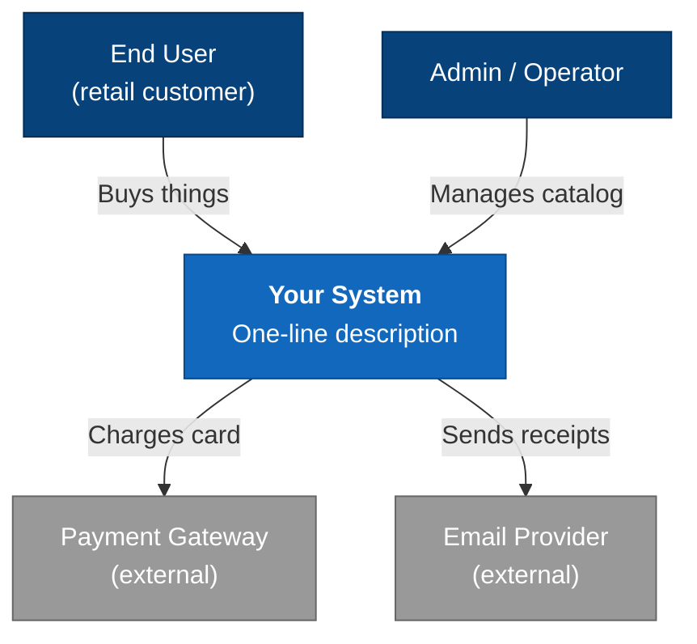
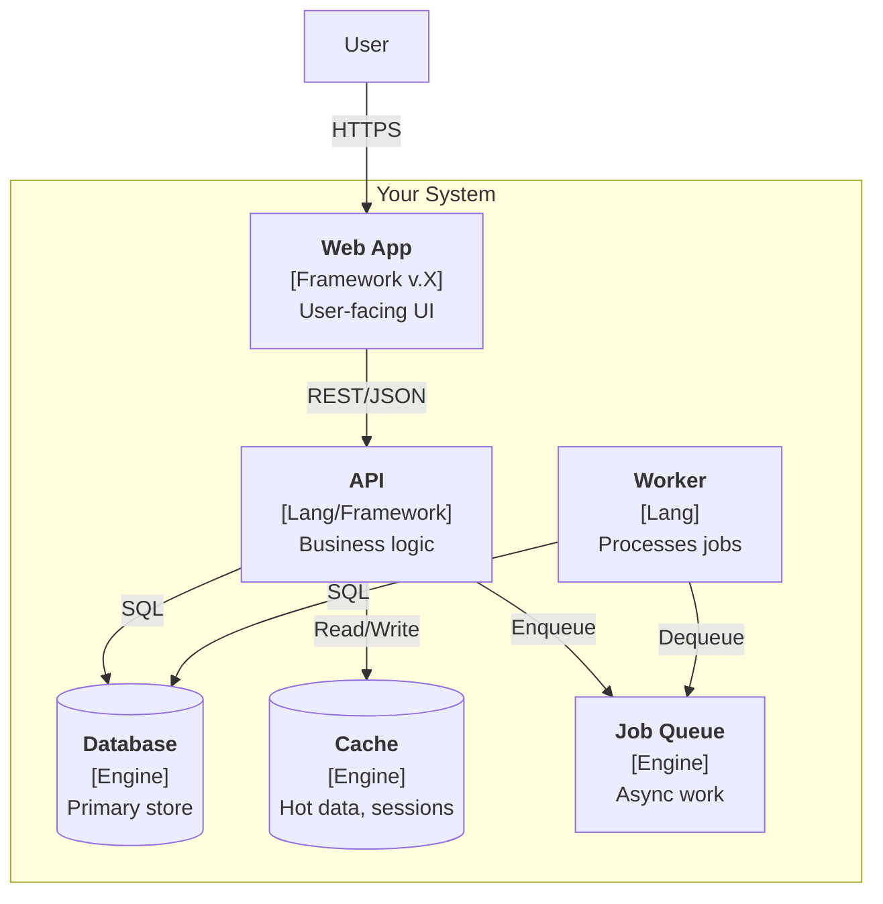
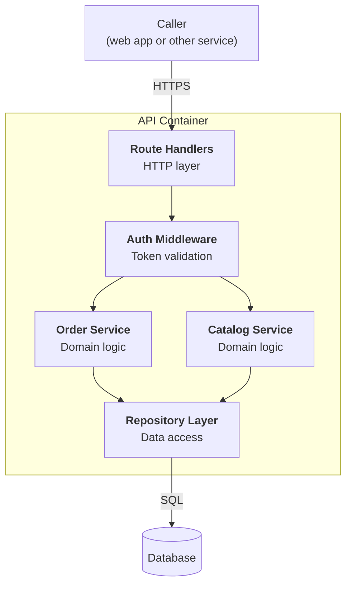
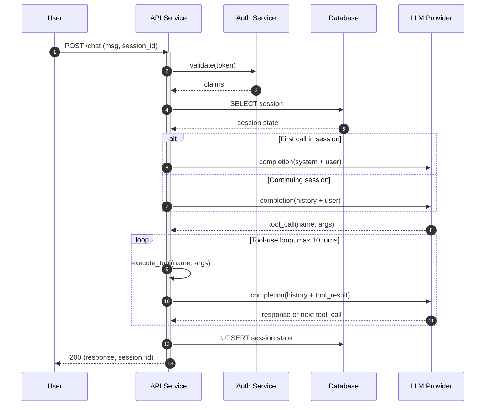
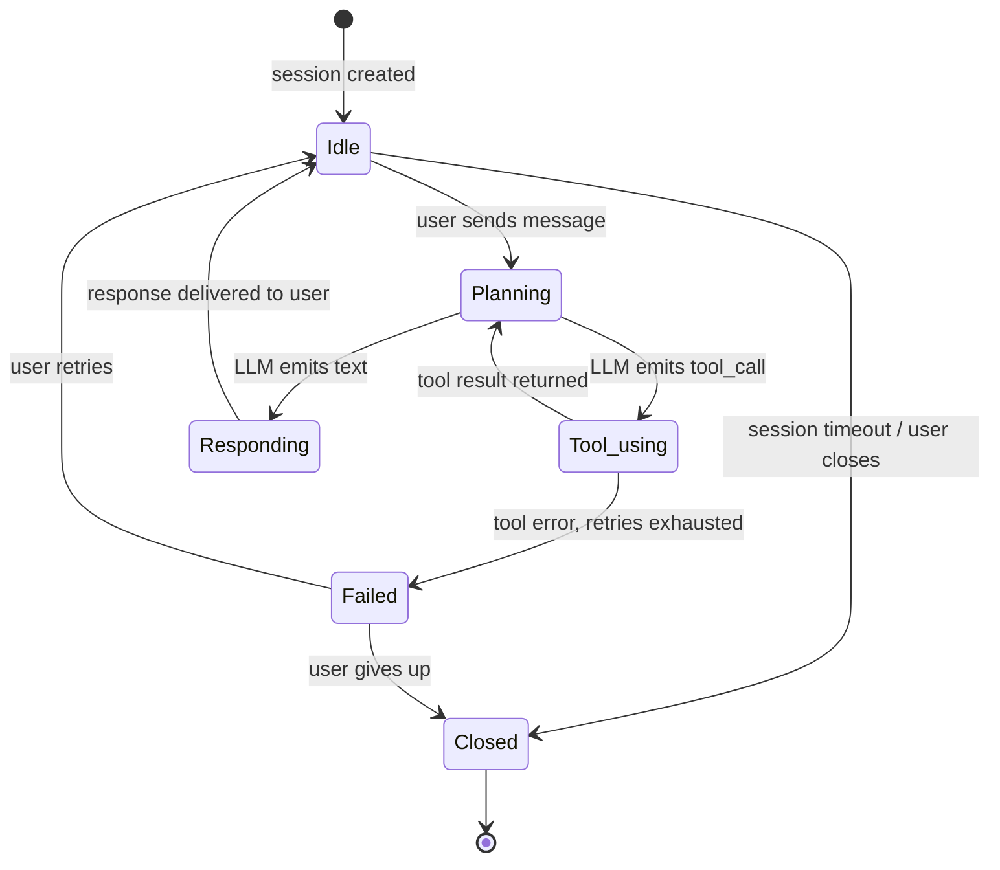
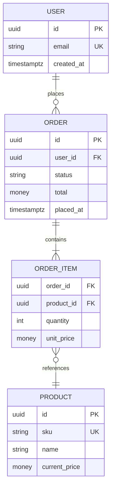
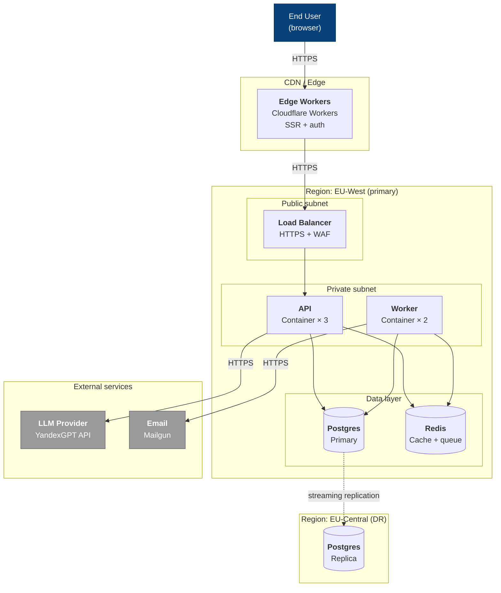

# architectural-diagrams

The single source of truth for diagrams in `archforge`. Five diagram types, all rendered as Mermaid, each appropriate for a different question.

## Pick the right type first

Before drawing, pick what's being asked. The diagram types are not interchangeable.

| Type | Answers the question | When to use | When NOT to use |
|---|---|---|---|
| **C4 (context / container / component / code)** | "What's the structural shape of the system?" | Architectural overview, onboarding, deployment scope | Showing message ordering or time |
| **Sequence** | "How do components interact over time for a specific scenario?" | Async flows, tool-use loops, distributed transactions, error handling, request lifecycles | Showing static topology |
| **State** | "What states does this entity move through, and on which events?" | Session lifecycle, agent state machine, workflow approval flow, retry/circuit-breaker logic | Showing structural relationships |
| **Entity-Relationship (ER)** | "What's the shape of the data model?" | Database schema design, domain model, persistence-relevant decisions | Showing runtime behavior |
| **Deployment** | "What runs where, and how is it networked?" | Infrastructure topology, multi-region setup, security zones, deployment posture | Showing application logic |

If a user asks for a "diagram" without specifying type, **infer from context** but say which one you're producing and why. If unclear, ask once before drawing.

If the user asks for a type that's wrong for what they're really after (e.g., "give me a state diagram of how the system is structured" — that's a C4 request), say so and propose the right type.

## C4

Simon Brown's notation. Four zoom levels, each answering one structural question. Not UML — C4 is built for conversation, not formal verification.

### Pick the right level

| Level | Audience | Question | When to draw |
|---|---|---|---|
| **L1: System Context** | Non-technical, business, newcomers | "How does the system fit in the world?" | Project start, onboarding, exec discussion |
| **L2: Container** | Engineers inside the project | "What deployable units does the system consist of?" | Architectural overview, deployment-as-design |
| **L3: Component** | Developers of a specific service | "How is one container internally organized?" | Designing or refactoring a service |
| **L4: Code** | Often nobody (auto-generated) | "Which classes / functions?" | Rarely drawn manually |

Most architectural conversations live at L1 + L2. L3 only for a specific module. L4 — almost never by hand.

### Universal C4 rules

- **Every arrow is labeled**: what flows (HTTP/JSON, gRPC, AMQP, ...) and why.
- **Every box names its technology**: `Vue 3 / Nuxt 4 / Pinia` or `PostgreSQL 16` in a sub-line.
- **Arrow direction = direction of dependency / request initiation**, not direction of data flow.
- **One level, one abstraction**. Don't mix containers and components on the same canvas.
- **A legend is mandatory** if you deviate from standard C4 colors.
- **No bidirectional arrows** — they almost always indicate the relationship is not thought through. One side initiates; draw that.

### L1: System Context — template

One box for your system. Around it, external actors (people, other systems). No internals.

### L2: Container — template

A container = independently deployable unit (SPA, API, DB, queue, worker). Always label the technology.

### L3: Component — template

Inside one container. Modules / layers, not individual files.

### Common C4 mistakes

1. **Mixing levels** — classes at L2, deployments at L3. Keep discipline.
2. **No technologies on boxes** — useless for technical conversation.
3. **Unlabeled arrows** — readers can't tell gRPC from AMQP.
4. **Too many boxes** — > 15 elements at L1/L2 means decompose, or show a partial view.
5. **External systems inside the trust boundary** — payment gateway is *external*, draw it that way.

## Sequence diagrams

Sequence diagrams show **interactions over time** between a small set of actors. They are the right tool when ordering matters — async tool-use, distributed transactions, retry logic, error propagation.

### When to draw a sequence diagram

- Tool-use loop in an LLM agent (especially when failover, retries, or multi-step calls matter).
- Authentication / authorization flows (OAuth, OIDC).
- Distributed transactions (saga, outbox).
- Error handling across service boundaries.
- Webhook / callback flows.
- Anything where "what happens first" is part of the design decision.

### Universal sequence rules

- **Time goes top-to-bottom**, actors are columns left-to-right.
- **Label every message** with what it carries (operation name + key payload).
- **Show the success and failure paths** — sequence diagrams that only show happy path miss the architectural insight.
- **Keep the actor set small** — 3 to 6. More than 7 and the diagram is unreadable.
- **Activations** (the bars on the lifelines) show when an actor is doing work. Use them when blocking semantics matter.
- **Group related interactions** in `alt`/`opt`/`loop`/`par` blocks where Mermaid supports them.

### Template

### Sequence anti-patterns

1. **Happy path only.** Always show at least one failure or fallback branch.
2. **Too many participants.** Split into multiple diagrams covering subsets.
3. **Implicit return values.** Every response should have a label saying what's returned.
4. **No activations on async work.** If an actor goes off and does work without blocking, that's worth showing.

## State diagrams

State diagrams show the lifecycle of a single thing — a session, a record, an entity, an agent — and the events that move it between states.

### When to draw a state diagram

- Agent state machine (idle / planning / tool-using / responding / blocked).
- Order or workflow lifecycle (draft / submitted / approved / rejected / fulfilled).
- Connection / session lifecycle.
- Retry and circuit-breaker logic.
- Anything where "what's allowed when, and what changes the state" is part of the design.

### Universal state rules

- **One subject per diagram.** A state diagram is about one thing, not three.
- **Every transition is labeled** with the event that triggers it (and optionally a guard condition).
- **Mark initial state** with `[*]` and final states explicitly.
- **No isolated states.** Every state must be reachable and have a defined exit, or be a final state.
- **Keep state count under 8.** More than that and the entity has multiple sub-machines that should be drawn separately.

### Template

### State diagram anti-patterns

1. **Mixing two entities' states.** A state diagram covers one subject. If you want session state and message state, draw two.
2. **Missing transitions.** If the state can be entered, the diagram must say what events trigger that.
3. **Too many "fail" states.** Group them into one `Failed` and use guards to distinguish causes if needed.
4. **No initial / final states.** Without `[*]` markers the diagram is incomplete.

## Entity-Relationship diagrams (ER)

ER diagrams show the persistent data model — entities, their attributes, and the relationships between them. Use these for database schema design conversations and when the data model is itself an architectural decision.

### When to draw an ER diagram

- Schema design or refactoring.
- Discussing tenant isolation models.
- Cross-service data ownership.
- Migration planning.
- Whenever the data shape is the load-bearing decision.

### Universal ER rules

- **Use crow's-foot or similar cardinality** notation. Mermaid does this natively.
- **Show only architecturally meaningful attributes.** A diagram with every column from every table is unreadable. Show keys, important attributes, and what makes the relationship.
- **Mark primary and foreign keys** explicitly.
- **Don't mix logical and physical models.** Pick one. Logical (entities, relationships) for design conversation; physical (tables, columns, indexes) for migration planning.
- **No more than ~10 entities** per diagram. Above that, scope down.

### Template

### ER diagram anti-patterns

1. **Including every column.** Filter to architecturally meaningful ones.
2. **No cardinalities.** A diagram without crow's-feet doesn't say much.
3. **Mixed logical and physical.** Decide which conversation you're having.
4. **Drawn from the existing schema rather than the design.** When designing, draw the target — when documenting, draw the truth.

## Deployment diagrams

Deployment diagrams show **what runs where** — physical or logical infrastructure topology, network boundaries, security zones, deployment regions.

### When to draw a deployment diagram

- Infrastructure decisions (which cloud, which regions).
- Network and security boundary discussions.
- Multi-region or geo-distributed designs.
- Compliance posture (where is PII processed and stored).
- Deployment pipeline architecture.

### Universal deployment rules

- **Show network boundaries clearly.** Trust zones, VPCs, security groups should be visible as containment.
- **Label deployment units** with what runs in them (container image, service name, technology).
- **Show data flow at the network level**, not at the application level (that's a sequence diagram).
- **External services are outside your boundary** — draw them outside.

### Template (Mermaid graph with subgraphs)

### Deployment diagram anti-patterns

1. **Mixing application logic and infrastructure.** This diagram is about where things run, not how they orchestrate work.
2. **Hiding network boundaries.** If subnets, VPCs, or trust zones matter to the discussion, they need to be visible.
3. **Treating cloud services as black boxes.** Name them — "AWS RDS Postgres 16, multi-AZ" beats "managed DB".
4. **Including every micro-service.** Group them at the level the conversation needs.

## Tooling alternatives

For most projects, Mermaid wins because it lives next to the code and renders everywhere. When it falls short:

| Tool | When |
|---|---|
| **Mermaid** | Default for everything in this skill. |
| **Structurizr DSL** | When generating all 4 C4 levels from one source matters; serious tooling investment. |
| **PlantUML + C4-PlantUML** | When team already runs PlantUML infrastructure. |
| **Excalidraw** | When the diagram is exploratory or doesn't need to live in version control. |
| **draw.io** | One-off architectural sketches with rich visual styling. |

## Where diagrams live

- Save Mermaid sources as `.md` files in `docs/architecture/diagrams/`.
- Naming: `<type>-<subject>.md` — e.g., `c4-l2-system.md`, `sequence-tool-use-loop.md`, `state-agent-session.md`, `er-billing.md`, `deployment-eu-region.md`.
- Reference them from `ARCHITECTURE.md` and from relevant ADRs.
- For binary diagrams (drawio, png), keep alongside an editable source — no images without sources.

## Refusing to render the wrong type

If a user asks for the wrong diagram type for their actual question, say so directly:

- "Show me the state of the system" → probably a C4 Container, not a state diagram. Confirm before drawing.
- "Diagram what happens when a request fails" → sequence with error path, not a state machine.
- "Draw the architecture of the database" → ER, possibly C4 Container with the data layer expanded, almost never C4 Component.

The right diagram depends on the question; the wrong one wastes both your effort and the reader's time.
