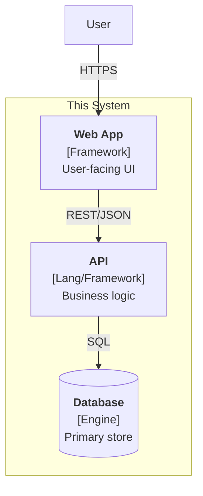

# Architecture

> **What this document is.** The living architectural state of this project — what the system is, what it must satisfy, how it's structured today, what decisions got it here, and what's still open. It is updated whenever any of those things change.
>
> **What it is not.** A design document, a roadmap, or a sales pitch. Keep it short, current, and honest. Stale or aspirational content here is worse than no content.
>
> **How to update it.** Touch this file in the same change as the code/ADR that changes its state. If a section is no longer accurate, fix it now — not "later".

---

## 1. System summary

<!--
One paragraph. What does this system do? Who uses it? What does it integrate with?
Optimize for a new engineer reading this on day one.
-->

_TODO: fill in._

---

## 2. Quality attributes

<!--
The non-functional requirements that drive design. Be specific. "Fast" is not a
requirement; "p95 < 200ms for the catalog endpoint" is.
-->

| Attribute | Target | Notes |
|---|---|---|
| Scale | _e.g., 10K DAU, 200 RPS peak_ | |
| Latency (p95) | _e.g., 200ms for read endpoints_ | |
| Availability | _e.g., 99.9%_ | |
| Consistency | _e.g., strong on payments, eventual elsewhere_ | |
| Durability | _e.g., zero data loss on orders_ | |
| Geographic distribution | _e.g., single region, EU_ | |

---

## 3. High-level structure

<!--
A C4 Container-level diagram. Mermaid is fine. Keep to ≤ ~12 boxes; if the
system is bigger, render a partial view and reference linked diagrams in
docs/architecture/diagrams/.
-->

_Replace the placeholder boxes with the real containers of this system._

For component-level (L3) detail of specific services, see [`docs/architecture/diagrams/`](./docs/architecture/diagrams/).

---

## 4. Key constraints

<!--
The forces that bound the design space. Things that won't change easily and
that any architectural choice must respect.
-->

- **Team** — _e.g., 3 engineers, 1 on-call rotation._
- **Operational** — _e.g., self-hosted on Hetzner; no managed cloud services._
- **Compliance / regulatory** — _e.g., GDPR; data must remain in EU._
- **Budget** — _e.g., <€500/mo infra._
- **Time** — _e.g., MVP target by month X._
- **Stack** — _e.g., team strongly familiar with Vue/Nuxt; Rust for systems-level work._

---

## 5. Decision index

<!--
Every accepted ADR appears here. Sorted by number, newest at top. One line each.
When an ADR is superseded, keep its row but mark the status; never delete.
-->

| # | Date | Status | Decision |
|---|---|---|---|
| _0001_ | _YYYY-MM-DD_ | _Accepted_ | _e.g., Use PostgreSQL as primary store_ |

ADR files live in [`docs/architecture/decisions/`](./docs/architecture/decisions/).

---

## 6. Open questions

<!--
Architectural questions deferred to a future cycle. Each entry should be specific
enough that someone could pick it up and run /archforge:cycle on it.
-->

- _e.g., How will we handle multi-tenant data isolation when we add a second customer?_
- _e.g., What's the long-term plan for offline support in the mobile client?_

---

## 7. Anti-patterns to avoid

<!--
Project-specific traps. Things the team has agreed NOT to do, with a one-line
reason. Future contributors (and AI agents) read this to avoid suggesting the
already-rejected approach.
-->

- _e.g., No microservices for now — team size doesn't justify the operational cost. Revisit at 8+ engineers._
- _e.g., No ORM auto-migrations in production — schema changes go through reviewed SQL._
- _e.g., No client-side feature flags for security gates — flags are for rollout, not for authz._
